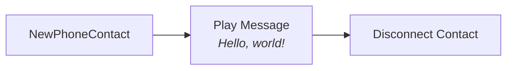
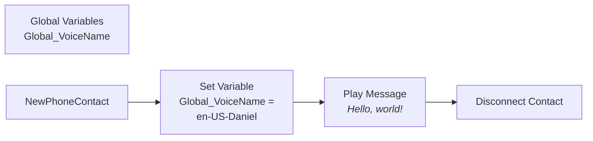
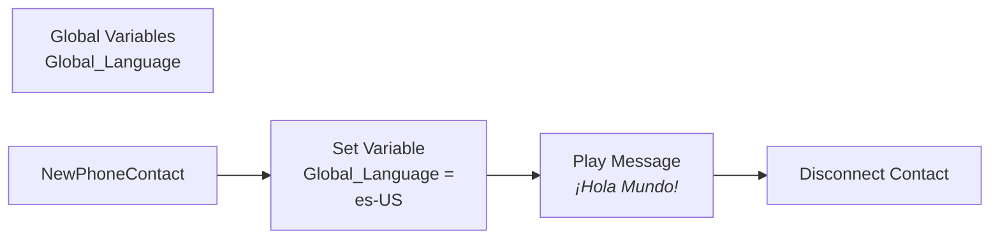
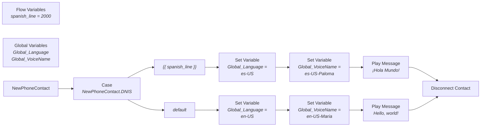
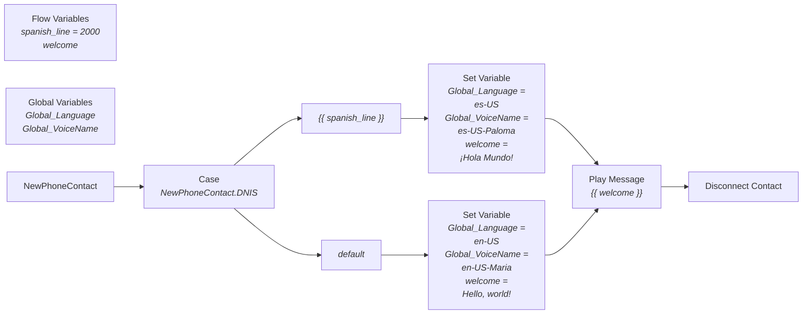
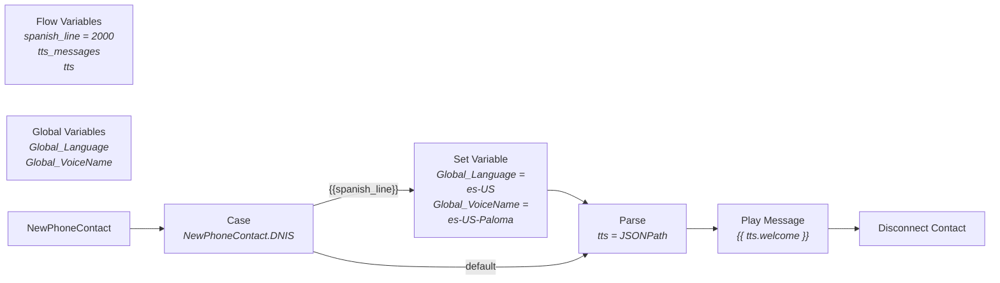
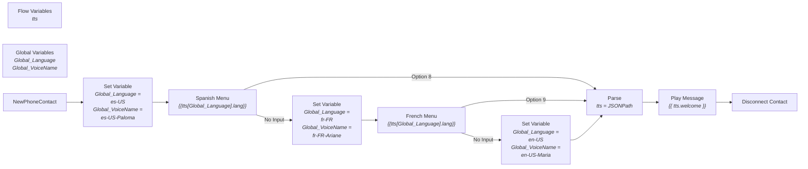

**Multilingual TTS** refers to a technique inside of Webex CC, which allows for multiple language support within a single Flow, with the use of Text to Speech (TTS), and without the need for parallel activities; making for a concise and effencient flow.

For the duration of this article, I will only be referencing the Cisco native TTS feature, which is documented [here](https://help.webex.com/en-us/article/ntkjqhw/Text-to-Speech-(TTS)-in-Webex-Contact-Center).

There are two main reasons to mention that:
1. It's included on all new WebexCC Trials and paid Subscriptions
2. It has a limitation in that we cannot switch languages inside of an Activity

> ##### TIP
> 
> This is not a limitation if you bring [Google TTS](https://help.webex.com/en-us/article/ctge8i/Configure-Google-connector-for-Webex-Contact-Center) to the party; therefore, your multilingual solution will look different, although this method would still work with Google TTS.
{: .block-tip}

# A Simple Default Language TTS Flow

In order to get TTS to work in your flow, you simply use an Activity which is capable of playing TTS to the caller, and type the literal text as you want it read out.

**Example:**

In the above example, the system will say "Hello, world!" to the caller in the default language and voice.

> ##### TIP
> 
> The default language is held in your Global Variable _Global_Language_ and your default voice is held in your Global Variable _Global_VoiceName_.  You can refer to the native TTS documentation for more information on language and voice name options.
{: .block-tip}

# Statically Changing the Voice

In order to change the voice, first refer to the native TTS documentation for your choices.  As of this writing, there are only two voice choices per language: one masculine voice and one feminin voice.  I will switch to the masculine voice for my default language in my example below.

**Example:**

> ##### TIP
> 
> I chose to set the language in the flow activity _Set Variable_, but you can change it in a few other ways, to include, but not limited to: Global Variable default value in Control Hub.  As long as you have it set to your chosen value prior to the _Play Message_ activity, so the system knows which voice to use.
{: .block-tip}

# Statically Changing the Language

The first thing you should know is: TTS is not a translation service.  If you tell the system to say "Hello" as an English word, but in the language of Spanish, it will not translate to "Hola."  You need to type the language specific words into TTS.

> ##### TIP
> 
> If you do ask TTS to speak "Hello" in Spanish, it will speak the English word with a Spanish accent.  You might actually want that, so it's good to know.
{: .block-tip}

In order to change the language, first refer to the native TTS documentation for your choices.  As of this writing, there are 22 languages to choose from.  I will switch to Spanish, US dialect: es-US, in my example below.

**Example:**

> ##### TIP
> 
> I do not speak any other language besides English, so I use [Google Translate](https://translate.google.com/) to get the text for TTS to play.  However, you may have native speakers inside your company, who might use less formal, or more formal speech, so translate as you see fit.
{: .block-tip}

## Changing Both Language and Voice

I think it should be clear at this time, that you can change both language and voice at the same time, in the same flow, simply by following both examples above, within the same flow.

# Dynamic Language by DNIS

Sometimes you publish phone numbers for specific language support, e.g., you publish a spanish only line in a spanish publication.  Therefore, your ability to set the language by phone number called, is fairly, but requires you to pick a method of mapping your DNIS to one or more values.  I have a [vidcast video](https://app.vidcast.io/share/7d47679c-c9fa-4c4a-8dcb-b79de2fee9f3?playerMode=vidcast) which covers five different options for doing so, you would just expand on this concept for language and voice names.

For the example below, I will use the simple option with the _Case_ activity, and I am introducing a new String variable _spanish\_line_ which holds the phone number for my...well...spanish line.  I'm using an example phone number of 2000, but as some of you may know, we would need a full +E164 number here in production.

**Example:**

Let us take a moment to realize that in order to speak to the customer in each language, I need two separate _Play Message_ activites, since I need to translate the words correctly and type them differently in each activity.  There is no ability to have language specific TTS inputs inside of a single activity. Possible future enhancement?  Let's hope!

Therefore, as our flow grows to include menus, queues, skills, further messages, etc., it will be obvious that we are building two parallel flows inside of our single flow, and that's not very effecient.  Let's fix that!

# Condensing TTS Activities

Luckily for us, the TTS input field inside of our activities supports Pebble syntax and expressions, therefore, if we simply hold the words we want to say in a String variable, then we can have a singular _Play Message_ activity, which of course extends to a singular _Menu_ activity, and so on.

Also, we've had the ability to set multiple variables inside of a _Set Variable_ activity for a little while now, so instead of having seprate boxes for each, I will combine them as well.

In the below example I am introducing a new String vairable _welcome_, which has no initial starting value, and is set at runtime, after we know which language the caller needs.

**Example:**

# Storing Text in JSON

Setting your text for _welcome_ in the flow activites is fine, but I think that if I scale this up, and my flow ends up with five languages and five prompts to play tot he customer, that setting 25 variables in my flow seems like a little too much.

If we use a JSON variable to store all of our language prompts, we could use a single _Parse_ activity to pull out just the TTS prompts for a given language, and then using JSON's dot-notation inside of Pebble, we could tell it which prompt to play, fairly easily.  Let's dive a little deeper.

I will be introducing a new JSON variable _tts_, which will hold the following value:

~~~ json
{
    "en-US": {
        "welcome": "Hello, world!"
    },
    "es-US": {
        "welcome": "¡Hola Mundo!"
    }
}
~~~

And since I'm ok with the default English language and voice, I will omit setting that at runtime for my default _Case_ as well.  Speaking of default case, I switched the diagram from using a rectangle for each case outcome, to just line descriptions, in an effort to keep the diagram small.

Finally, I am introducing a _Parse_ activity, which will replace the contents of the _tts_ variable, with just the prompts needed for the required language.  It will have the following settings:

* Input Variable = `tts`
* Type = `JSON`
* Output Variable = `tts`
* JSONPath = `$["{{Global_Language}}"]`

Once the parse has worked its magic, the contents of the _tts_ variable will look like this (assuming English):

~~~ json
{
    "welcome": "Hello, world!"
}
~~~

This allows us to refer to the welcome prompt, simply as `{{ tts.welcome }}`, as you'll see in the below example.

> ##### TIP
> 
> If you wish to keep the original TTS JSON intact, just use two separate JSON variables: one to hold the complete list of prompts, and one to hold the language specific list of prompts. E.g., tts_all and tts_lang.
{: .block-tip}

**Example:**

# Menu Driven Language Choice

If you would like to present the caller with a menu, asking them to make a language selection, things get a little more complex, considering you cannot use multiple languages inside of a single activity, at the same time.  The way I solve this, is to ask the caller for each language choice in a separate consecutive menus.  For this example, I will introduce a third language, French, which makes Spanish option 8 and French option 9.  English will be the default.

My _tts_ JSON variable would look like this:

~~~ json
{
    "en-US": {
        "welcome": "Hello, world!"
    },
    "es-US": {
        "lang": "Para español, presione 8.",
        "welcome": "¡Hola Mundo!"
    },
    "fr-FR": {
        "lang": "Pour le français, appuyez sur 9.",
        "welcome": "Bonjour le monde!"
    }
}
~~~

**Example:**

