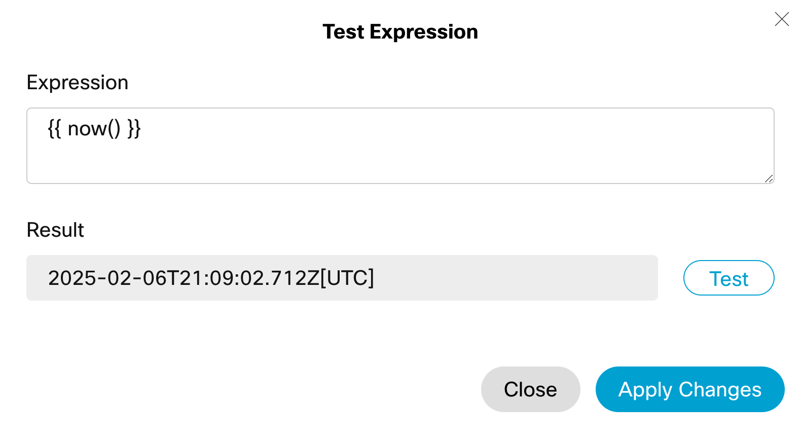
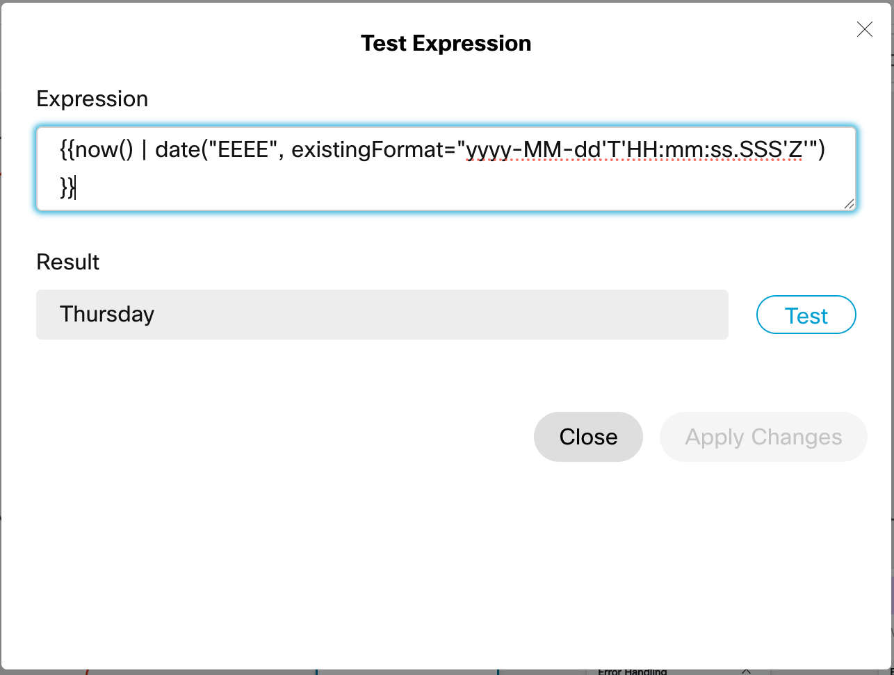
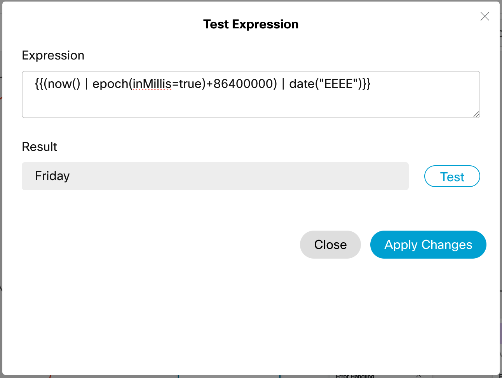
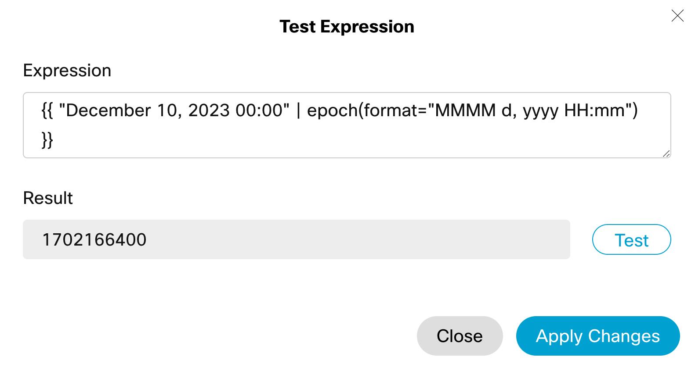
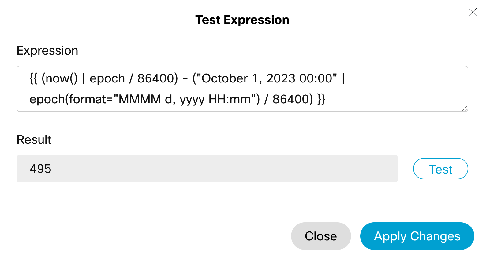
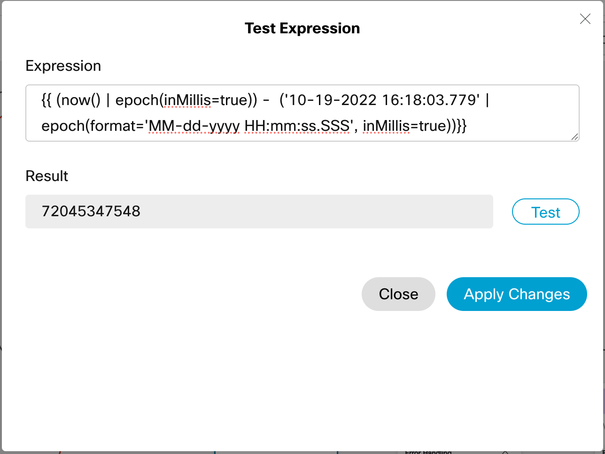

## Pebble Playground

**Pebble Playground** is a collection of useful pebble expressions for use in Webex Contact Centre flows.

# Time Expressions

This section contains time related expressions and functions, useful for processing hold times, days of week, etc.

<textarea readonly="">{{now()}}</textarea>

Returns the current date and time.

`\{\{now()|epoch\}\}`

Returns the current date and time in epoch format.

`\{\{now() | date("EEEE", existingFormat="yyyy-MM-dd'T'HH:mm:ss.SSS'Z'") \}\}`

Returns the name of the current day.

`\{\{(now() | epoch(inMillis=true)+86400000) | date("EEEE")\}\}`

Returns the name of tomorrow.

`\{\{ "December 10, 2023" | date("MM-dd-yyyy HH:mm:ss", existingFormat="MMMM dd, yyyy") | epoch(format='MM-dd-yyyy HH:mm:ss')\}\}`

Gives the epoch timestamp of a specific date.

`\{\{    (now() | date("MM-dd-yyyy HH:mm:ss", existingFormat="yyyy-MM-dd'T'HH:mm:ss.SSS'Z'", timeZone="America/Chicago") | epoch(format='MM-dd-yyyy HH:mm:ss')  - ('10-01-2023 00:00:00' | epoch(format='MM-dd-yyyy HH:mm:ss'))) / (606024) \}\}`

Returns the number of days between now and a given date.

`\{\{ (now() | epoch(inMillis=true)) -  ('10-19-2022 16:18:03.779' | epoch(format='MM-dd-yyyy HH:mm:ss.SSS', inMillis=true))\}\}`

Returns the number of Ms between now and a given date.

